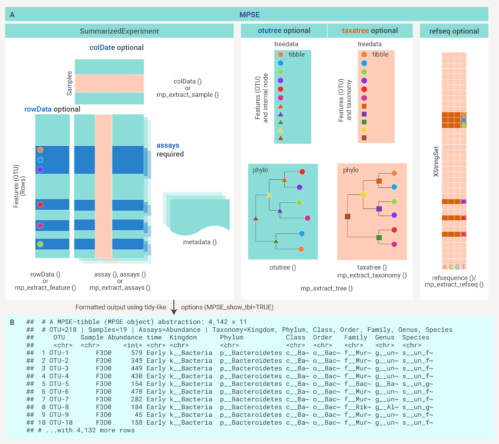
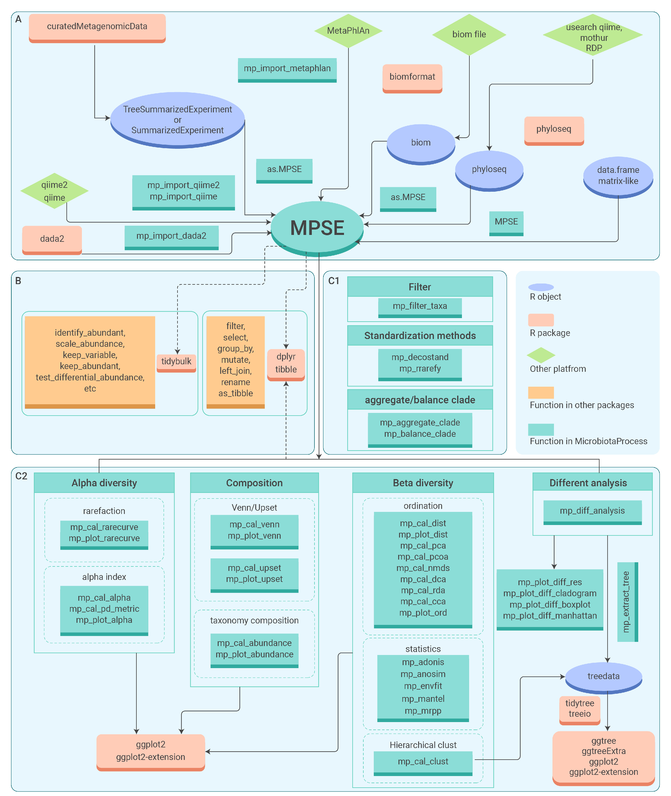

<!-- README.md is generated from README.Rmd. Please edit that file -->

# MicrobiotaProcess: A comprehensive R package for managing and analyzing microbiome and other ecological data within the tidy framework

[](https://www.bioconductor.org/packages/MicrobiotaProcess)
[](https://github.com/YuLab-SMU/MicrobiotaProcess)
[](https://www.bioconductor.org/packages/devel/bioc/html/MicrobiotaProcess.html#since)
[](https://www.bioconductor.org/packages/devel/bioc/html/MicrobiotaProcess.html#archives)

  - [**MicrobiotaProcess**](http://bioconductor.org/packages/release/bioc/html/MicrobiotaProcess.html)
    defines an **MPSE** structure to better integrate both primary and
    intermediate microbiome datasets.
  - **MicrobiotaProcess** improves the integration and exploration of
    downstream data analysis.
  - **MicrobiotaProcess** provides a set of functions under a unified
    tidy framework, which helps users explore related datasets more
    efficiently.
  - **MicrobiotaProcess** offers many visual methods to quickly render
    clear and comprehensive visualizations that reveal meaningful
    insights.

## Anatomy of a **MPSE**

<div class="figure" style="text-align: center">



<p class="caption">

The structure of the MPSE class.

</p>

</div>

## Overview of the design of **MicrobiotaProcess** package

<div class="figure" style="text-align: center">



<p class="caption">

The Overview of the design of MicrobiotaProcess package

</p>

</div>

## :writing\_hand: Authors

[Shuangbin Xu](https://github.com/xiangpin) and [Guangchuang
Yu](https://guangchuangyu.github.io)

School of Basic Medical Sciences, Southern Medical University

If you use **MicrobiotaProcess** in published research. Please cite the
paper:

**Shuangbin Xu**, Li Zhan, Wenli Tang, Qianwen Wang, Zehan Dai, Land
Zhou, Tingze Feng, Meijun Chen, Tianzhi Wu, Erqiang Hu, **Guangchuang
Yu**<sup>\*</sup>. MicrobiotaProcess: A comprehensive R package for deep
mining microbiome. *The Innovation*. 2023, 100388. doi:
[10.1016/j.xinn.2023.100388](https://www.sciencedirect.com/science/article/pii/S2666675823000164).

  - [Source code to produce Supplementary
    Material](https://github.com/YuLab-SMU/MP_supplementary_file)

## :arrow\_double\_down: Installation

Get the released version from
[Bioconductor](https://bioconductor.org/packages/release/bioc/html/MicrobiotaProcess.html):

``` r
## try http:// if https:// URLs are not supported ## the url of mirror
if (!requireNamespace("BiocManager", quietly=TRUE))
    install.packages("BiocManager")
## BiocManager::install("BiocUpgrade") ## you may need this
BiocManager::install("MicrobiotaProcess")
```

the development version from github:

``` r
if (!requireNamespace("remotes", quietly=TRUE))
    install.packages("remotes")
remotes::install_github("YuLab-SMU/MicrobiotaProcess")
```

# :book: Vignette

For more details, please refer to the [online
vignette](https://bioconductor.org/packages/release/bioc/vignettes/MicrobiotaProcess/inst/doc//MicrobiotaProcess.html).

## :sparkling\_heart: Contributing

We welcome any contributions\! By participating in this project you
agree to abide by the terms outlined in the [Contributor Code of
Conduct](CONDUCT.md).
