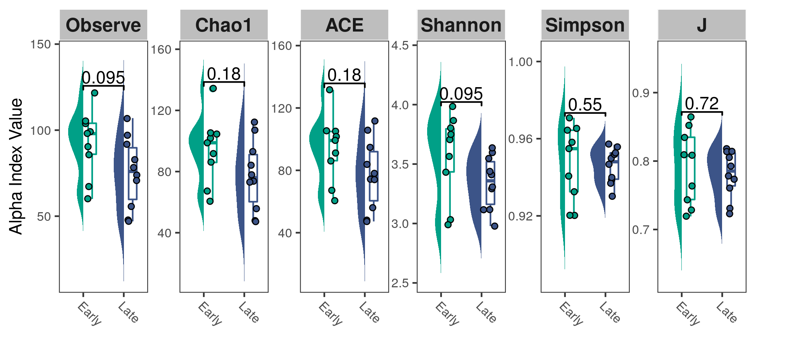
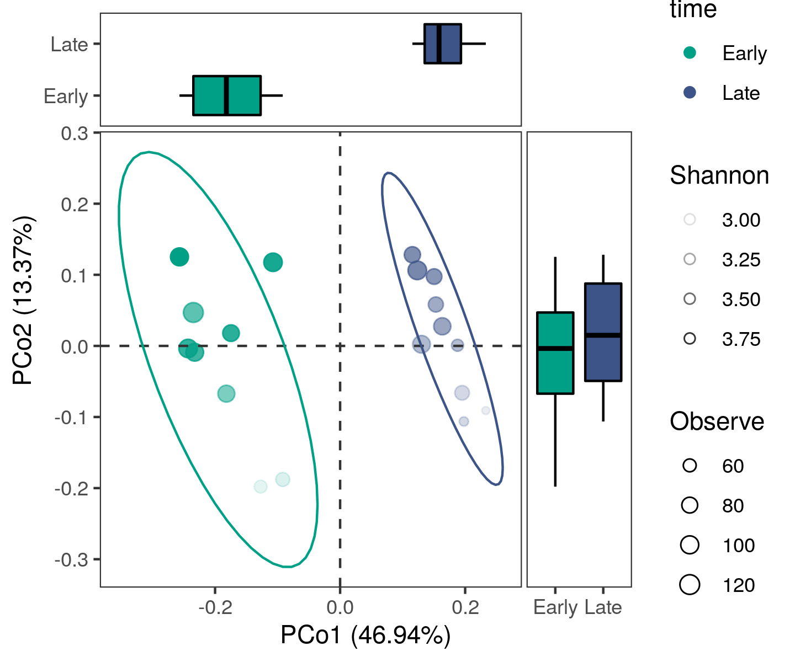

<!-- README.md is generated from README.Rmd. Please edit that file -->

# MicrobiotaProcess: an R package for analysis, visualization and biomarker discovery of microbiome

MicrobiotaProcess is an R package for analysis, visualization and
biomarker discovery of microbial datasets. It introduces a tidy
microbiome data structure paradigm and analysis grammar. It supports
calculating alpha index and provides functions to visualize rarefaction
curves. Moreover, it also supports visualizing the abundance of taxonomy
of samples. And It also provides functions to perform the PCA, PCoA and
hierarchical cluster analysis. In addition, MicrobiotaProcess also
provides a method for the biomarker discovery of metagenome or other
datasets.

### tidy microbiome data structure

``` r
library(MicrobiotaProcess)
data(mouse.time.mpse)
mouse.time.mpse
```

    ## # A MPSE-tibble (MPSE object) abstraction: 4,408 × 11
    ## # OTU=232 | Samples=19 | Assays=Abundance | Taxanomy=Kingdom, Phylum, Class, Order, Family, Genus, Species
    ##    OTU    Sample Abundance time  Kingdom Phylum Class Order Family Genus Species
    ##    <chr>  <chr>      <int> <chr> <chr>   <chr>  <chr> <chr> <chr>  <chr> <chr>  
    ##  1 OTU_1  F3D0         579 Early k__Bac… p__Ba… c__B… o__B… f__Mu… g__u… s__un_…
    ##  2 OTU_2  F3D0         345 Early k__Bac… p__Ba… c__B… o__B… f__Mu… g__u… s__un_…
    ##  3 OTU_3  F3D0         449 Early k__Bac… p__Ba… c__B… o__B… f__Mu… g__u… s__un_…
    ##  4 OTU_4  F3D0         430 Early k__Bac… p__Ba… c__B… o__B… f__Mu… g__u… s__un_…
    ##  5 OTU_5  F3D0         154 Early k__Bac… p__Ba… c__B… o__B… f__Ba… g__B… s__un_…
    ##  6 OTU_6  F3D0         470 Early k__Bac… p__Ba… c__B… o__B… f__Mu… g__u… s__un_…
    ##  7 OTU_7  F3D0         282 Early k__Bac… p__Ba… c__B… o__B… f__Mu… g__u… s__un_…
    ##  8 OTU_8  F3D0         184 Early k__Bac… p__Ba… c__B… o__B… f__Ri… g__A… s__un_…
    ##  9 OTU_9  F3D0          45 Early k__Bac… p__Ba… c__B… o__B… f__Mu… g__u… s__un_…
    ## 10 OTU_10 F3D0         158 Early k__Bac… p__Ba… c__B… o__B… f__Mu… g__u… s__un_…
    ## # … with 4,398 more rows

### Unified analysis grammar

#### Alpha diversity analysis

``` r
# example of the analysis of alpha diversity
library(ggplot2)
library(ggsignif)
library(gghalves)
mpse <- mouse.time.mpse %>%
        mp_rrarefy() %>%
        mp_cal_alpha(.abundance=RareAbundance)

mpse %>% print(n=5)
```

    ## # A MPSE-tibble (MPSE object) abstraction: 4,408 × 18
    ## # OTU=232 | Samples=19 | Assays=Abundance, RareAbundance | Taxanomy=Kingdom, Phylum, Class, Order, Family, Genus, Species
    ##   OTU   Sample Abundance RareAbundance time  Observe Chao1   ACE Shannon Simpson
    ##   <chr> <chr>      <int>         <int> <chr>   <dbl> <dbl> <dbl>   <dbl>   <dbl>
    ## 1 OTU_1 F3D0         579           214 Early     104  104.  105.    3.88   0.965
    ## 2 OTU_2 F3D0         345           116 Early     104  104.  105.    3.88   0.965
    ## 3 OTU_3 F3D0         449           179 Early     104  104.  105.    3.88   0.965
    ## 4 OTU_4 F3D0         430           167 Early     104  104.  105.    3.88   0.965
    ## 5 OTU_5 F3D0         154            54 Early     104  104.  105.    3.88   0.965
    ## # … with 4,403 more rows, and 8 more variables: J <dbl>, Kingdom <chr>, Phylum <chr>, Class <chr>,
    ## #   Order <chr>, Family <chr>, Genus <chr>, Species <chr>

``` r
p <- mpse %>% mp_plot_alpha(.group=time, .alpha=c(Observe,Chao1, ACE, Shannon, Simpson, J))
p <- p + 
    scale_fill_manual(values=c("#00A087FF", "#3C5488FF"), guide="none") + 
    scale_color_manual(values=c("#00A087FF", "#3C5488FF"), guide="none") 
p
```



#### PCoa analysis

``` r
mpse %<>% 
    mp_decostand(.abundance=Abundance) %>%
    mp_cal_pcoa(.abundance=hellinger)
mpse %>% print(n=5)
```

    ## # A MPSE-tibble (MPSE object) abstraction: 4,408 × 23
    ## # OTU=232 | Samples=19 | Assays=Abundance, RareAbundance, hellinger | Taxanomy=Kingdom, Phylum, Class, Order, Family, Genus, Species
    ##   OTU   Sample Abundance RareAbundance hellinger time  Observe Chao1   ACE
    ##   <chr> <chr>      <int>         <int>     <dbl> <chr>   <dbl> <dbl> <dbl>
    ## 1 OTU_1 F3D0         579           214     0.298 Early     104  104.  105.
    ## 2 OTU_2 F3D0         345           116     0.230 Early     104  104.  105.
    ## 3 OTU_3 F3D0         449           179     0.262 Early     104  104.  105.
    ## 4 OTU_4 F3D0         430           167     0.257 Early     104  104.  105.
    ## 5 OTU_5 F3D0         154            54     0.154 Early     104  104.  105.
    ## # … with 4,403 more rows, and 14 more variables: Shannon <dbl>, Simpson <dbl>, J <dbl>,
    ## #   bray <I<list>>, PCo1 (46.94%) <dbl>, PCo2 (13.37%) <dbl>,
    ## #   PCo3 (8.25%) <dbl>, Kingdom <chr>, Phylum <chr>, Class <chr>, Order <chr>,
    ## #   Family <chr>, Genus <chr>, Species <chr>

``` r
p2 <- mpse %>% mp_plot_ord(.ord = pcoa, 
                           .group = time, 
                           .size = Observe, 
                           .alpha = Shannon, 
                           ellipse = TRUE, 
                           .color = time,
                           show.legend = FALSE
                          )
p2 <- p2 +
      scale_fill_manual(values=c("#00A087FF", "#3C5488FF")) +
      scale_color_manual(values=c("#00A087FF", "#3C5488FF")) +
      scale_size_continuous(range=c(1, 3))
p2
```

<!-- -->

<!--

tbl <- mpse %>%
       mp_extract_sample()

tbl %>% print(n=5)
tbl %<>% tidyr::pivot_longer(
                         cols=!c("Sample", "time"), 
                         names_to="measure", 
                         values_to="alpha"
                       ) %>%
         dplyr::mutate(measure=forcats::fct_relevel(measure, 
                       c("Observe", "Chao1", "ACE", "Simpson", "Shannon", "J"))
                   )
tbl %>% print(n=5)
p <- ggplot(data=tbl, aes(x=time, y=alpha, fill=time)) +
     geom_half_violin(color=NA, side="l", trim=FALSE) +
     geom_boxplot(aes(color=time), fill=NA, position=position_nudge(x=.22), width=0.2) +
     geom_half_point(side="r", shape=21, size=1.2) +
     geom_signif(comparisons=list(c("Early", "Late")), 
                 margin_top = 0.2,
                 test="wilcox.test", 
                 textsize=2) +
     facet_wrap(facet=vars(measure), scales="free_y", nrow=1) +
     scale_fill_manual(values=c("#00A087FF", "#3C5488FF"), guide="none") +
     scale_color_manual(values=c("#00A087FF", "#3C5488FF"), guide="none") +
     labs(x=NULL, y="alpha diversity index")
p

-->

## :writing\_hand: Authors

[Shuangbin Xu](https://github.com/xiangpin) and [Guangchuang
Yu](https://guangchuangyu.github.io)

School of Basic Medical Sciences, Southern Medical University

## :arrow\_double\_down: Installation

Get the released version from
[Bioconductor](https://bioconductor.org/packages/release/bioc/html/MicrobiotaProcess.html):

``` r
## try http:// if https:// URLs are not supported ## the url of mirror
if (!requireNamespace("BiocManager", quietly=TRUE))
    install.packages("BiocManager")
## BiocManager::install("BiocUpgrade") ## you may need this
BiocManager::install("MicrobiotaProcess")
```

the development version from github:

``` r
if (!requireNamespace("remotes", quietly=TRUE))
    install.packages("remotes")
remotes::install_github("YuLab-SMU/MicrobiotaProcess")
```

## :sparkling\_heart: Contributing

We welcome any contributions\! By participating in this project you
agree to abide by the terms outlined in the [Contributor Code of
Conduct](CONDUCT.md).
