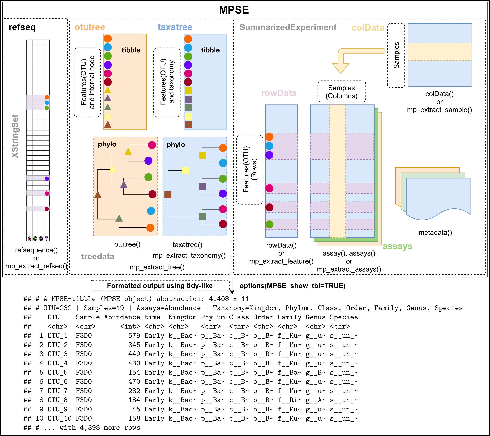
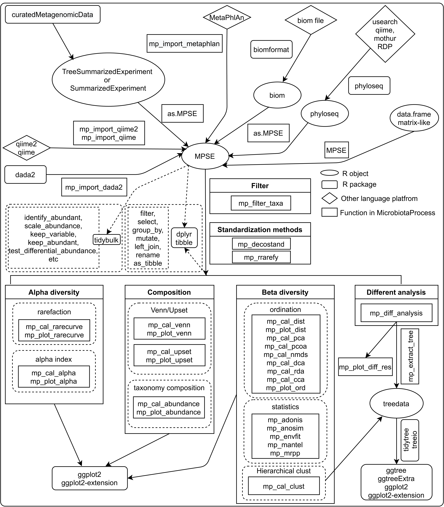

```{r, echo=FALSE, results="asis", message=FALSE, KnitrSetUp}
library(knitr)
knit_hooks$set(crop = hook_pdfcrop)
knitr::opts_chunk$set(crop = TRUE, tidy=FALSE, warning=FALSE,message=FALSE, fig.align="center")
Biocpkg <- function (pkg){
    sprintf("[%s](http://bioconductor.org/packages/%s)", pkg, pkg)
}

CRANpkg <- function(pkg){
    cran <- "https://CRAN.R-project.org/package" 
    fmt <- "[%s](%s=%s)"
    sprintf(fmt, pkg, cran, pkg) 
}
```

```{r, echo=FALSE, results="hide", message=FALSE, Loadpackages}
library(ggplot2)
library(phyloseq)
library(ggtree)
library(ggtreeExtra)
library(treeio)
library(tidytree)
library(MicrobiotaProcess)
```

# 1. Anatomy of a **MPSE**

`MicrobiotaProcess` introduces `MPSE` S4 class. This class inherits the `SummarizedExperiment`[@SE] class. Here, the `assays` slot is used to store the rectangular abundance matrices of features for a microbiome experimental results. The `colData` slot is used to store the meta-data of sample and some results about samples in the downstream analysis. The `rowData` is used to store the meta-data of features and some results about the features in the downstream analysis. Compared to the `SummarizedExperiment` object, `MPSE` introduces the following additional slots:

+ taxatree: is a `treedata`[@treeio; @tidytree] class contained phylo class (hierarchical structure) and tibble class (associated data) to store the taxonomy information, the tip labels of taxonomy tree are the rows of the `assays`, but the internal node labels contain the differences level taxonomy of the rows of the `assays`. The tibble class contains the taxonomy classification of node labels.
+ otutree: is also a `treedata` class to store the phylogenetic tree (based with reference sequences) and the associated data, which its tip labels are also the rows of the assays.
+ refseq: is a `XStringSet`[@Biostrings] class contained reference sequences, which its names are also identical with the rows of the assays.

```{r, echo=FALSE, fig.width = 12, dpi=400, fig.align="center", fig.cap= "The structure of the MPSE class."}

```

# 2. Overview of the design of **MicrobiotaProcess** package

With this data structure, `MicrobiotaProcess` will be more interoperable with the existing computing ecosystem. For example, the slots inherited `SummarizedExperiment` can be extracted via the methods provided by `SummarizedExperiment`. The `taxatree` and `otutree` can also be extracted via `mp_extract_tree`, and they are compatible with `ggtree`[@yu2017ggtree], `ggtreeExtra`[@ggtreeExtra], `treeio`[@treeio] and `tidytree`[@tidytree] ecosystem since they are all `treedata` class, which is a data structure used directly by these packages. 

Moreover, the results of upstream analysis of microbiome based some tools, such as `qiime2`[@qiime2], `dada2`[@dada2] and `MetaPhlAn`[@metaphlan] or other classes (`SummarizedExperiment`[@SE], `phyloseq`[@ps] and `TreeSummarizedExperiment`[@TSE]) used to store the result of microbiome can  be loaded or transformed to the `MPSE` class.

In addition, `MicrobiotaProcess` also introduces a tidy microbiome data structure paradigm and analysis grammar. It provides a wide variety of microbiome analysis procedures under a unified and common framework (tidy-like framework). We believe `MicrobiotaProcess` can improve the efficiency of related researches, and it also bridges microbiome data analysis with the `tidyverse`[@tidyverse].

```{r, echo=FALSE, fig.width = 12, dpi=400, fig.align="center", fig.cap="The Overview of the design of MicrobiotaProcess package"}

```

# 3. **MicrobiotaProcess** profiling

## 3.1 bridges other tools

`MicrobiotaProcess` provides several functions to parsing the output of upstream analysis tools of microbiome, such as qiime2[@qiime2], dada2[@dada2] and MetaPhlAn[@metaphlan], and return `MPSE` object. Some bioconductor class, such as `phyloseq`[@ps], `TreeSummarizedExperiment`[@TSE] and `SummarizedExperiment`[@SE] can also be converted to `MPSE` via `as.MPSE()`.

```{r, warning=FALSE, message=FALSE}
library(MicrobiotaProcess)
#parsing the output of dada2
seqtabfile <- system.file("extdata", "seqtab.nochim.rds", package="MicrobiotaProcess")
seqtab <- readRDS(seqtabfile)
taxafile <- system.file("extdata", "taxa_tab.rds", package="MicrobiotaProcess")
seqtab <- readRDS(seqtabfile)
taxa <- readRDS(taxafile)
# the seqtab and taxa are output of dada2
sampleda <- system.file("extdata", "mouse.time.dada2.txt", package="MicrobiotaProcess")
mpse1 <- mp_import_dada2(seqtab=seqtab, taxatab=taxa, sampleda=sampleda)
mpse1

# parsing the output of qiime2
otuqzafile <- system.file("extdata", "table.qza", package="MicrobiotaProcess")
taxaqzafile <- system.file("extdata", "taxa.qza", package="MicrobiotaProcess")
mapfile <- system.file("extdata", "metadata_qza.txt", package="MicrobiotaProcess")
mpse2 <- mp_import_qiime2(otuqza=otuqzafile, taxaqza=taxaqzafile, mapfilename=mapfile)
mpse2

# parsing the output of MetaPhlAn
file1 <- system.file("extdata/MetaPhlAn", "metaphlan_test.txt", package="MicrobiotaProcess")
sample.file <- system.file("extdata/MetaPhlAn", "sample_test.txt", package="MicrobiotaProcess")
mpse3 <- mp_import_metaphlan(profile=file1, mapfilename=sample.file)
mpse3
# convert phyloseq object to mpse
data(test_otu_data)
test_otu_data
mpse4 <- test_otu_data %>% as.MPSE() 
mpse4
# convert TreeSummarizedExperiment object to mpse
# library(curatedMetagenomicData)
# tse <- curatedMetagenomicData::curatedMetagenomicData("ZhuF_2020.relative_abundance", dryrun=F)
# tse[[1]] %>% as.MPSE() -> mpse5
# mpse5
```

## 3.2 alpha diversity analysis

Rarefaction, based on sampling technique, was used to compensate for the effect of sample size on the number of units observed in a sample[@siegel2004rarefaction]. `MicrobiotaProcess` provided `mp_cal_rarecurve` and `mp_plot_rarecurve` to calculate and plot the curves based on `rrarefy` of `r CRANpkg("vegan")`[@Jari2019vegan].

```{r, fig.align="center", fig.width=12, fig.height=4, fig.cap="The rarefaction of samples or groups"}
library(ggplot2)
library(MicrobiotaProcess)
data(mouse.time.mpse)
mouse.time.mpse
# Rarefied species richness
mouse.time.mpse %<>% mp_rrarefy()
# 'chunks' represent the split number of each sample to calculate alpha
# diversity, default is 400. e.g. If a sample has total 40000
# reads, if chunks is 400, it will be split to 100 sub-samples
# (100, 200, 300,..., 40000), then alpha diversity index was
# calculated based on the sub-samples. 
# '.abundance' the column name of abundance, if the '.abundance' is not be 
# rarefied calculate rarecurve, user can specific 'force=TRUE'.
mouse.time.mpse %<>% 
    mp_cal_rarecurve(
        .abundance = RareAbundance,
        chunks = 400
    )
# The RareAbundanceRarecurve column will be added the colData slot 
# automatically (default action="add")
mouse.time.mpse %>% print(width=180)
# default will display the confidence interval around smooth.
# se=TRUE
p1 <- mouse.time.mpse %>% 
      mp_plot_rarecurve(
         .rare = RareAbundanceRarecurve, 
         .alpha = Observe,
      )

p2 <- mouse.time.mpse %>% 
      mp_plot_rarecurve(
         .rare = RareAbundanceRarecurve, 
         .alpha = Observe, 
         .group = time
      ) +
      scale_color_manual(values=c("#00A087FF", "#3C5488FF")) +
      scale_fill_manual(values=c("#00A087FF", "#3C5488FF"), guide="none")

# combine the samples belong to the same groups if 
# plot.group=TRUE
p3 <- mouse.time.mpse %>% 
      mp_plot_rarecurve(
         .rare = RareAbundanceRarecurve, 
         .alpha = "Observe", 
         .group = time, 
         plot.group = TRUE
      ) +
       scale_color_manual(values=c("#00A087FF", "#3C5488FF")) +
       scale_fill_manual(values=c("#00A087FF", "#3C5488FF"),guide="none")  

p1 + p2 + p3
# Users can extract the result with mp_extract_rarecurve to extract the result of mp_cal_rarecurve 
# and visualized the result manually.
```

## 3.3 calculate alpha index and visualization

Alpha diversity can be estimated the species richness and evenness of some species communities. `MicrobiotaProcess` provides `mp_cal_alpha` to calculate alpha index (Observe, Chao1, ACE, Shannon, Simpson and J (Pielou's evenness)) and the `mp_plot_alpha` to visualize the result. 

```{r, fig.width=7, fig.height=7, fig.align="center", message=FALSE, fig.cap="The alpha diversity comparison"}
library(ggplot2)
library(MicrobiotaProcess)
mouse.time.mpse %<>% 
    mp_cal_alpha(.abundance=RareAbundance)
mouse.time.mpse
f1 <- mouse.time.mpse %>% 
      mp_plot_alpha(
        .group=time, 
        .alpha=c(Observe, Chao1, ACE, Shannon, Simpson, J)
      ) +
      scale_fill_manual(values=c("#00A087FF", "#3C5488FF"), guide="none") +
      scale_color_manual(values=c("#00A087FF", "#3C5488FF"), guide="none")

f2 <- mouse.time.mpse %>%
      mp_plot_alpha(
        .alpha=c(Observe, Chao1, ACE, Shannon, Simpson, J)
      )

f1 / f2
```

Users can extract the result with mp_extract_sample() to extract the result of mp_cal_alpha and visualized the result manually, see the example of mp_cal_alpha.

## 3.4 The visualization of taxonomy abundance

`MicrobiotaProcess` provides the `mp_cal_abundance`, `mp_plot_abundance` to calculate and plot the composition of species communities. And the `mp_extract_abundance` can extract the abundance of specific taxonomy level. User can also extract the abundance table to perform external analysis such as visualize manually (see the example of `mp_cal_abundance`).

```{r, fig.align="center", fig.width=8, fig.height=8, fig.cap="The relative abundance and abundance of top 20 phyla of all samples "}
mouse.time.mpse 
mouse.time.mpse %<>%
    mp_cal_abundance( # for each samples
      .abundance = RareAbundance
    ) %>%
    mp_cal_abundance( # for each groups 
      .abundance=RareAbundance,
      .group=time
    )
mouse.time.mpse

# visualize the relative abundance of top 20 phyla for each sample.
p1 <- mouse.time.mpse %>%
         mp_plot_abundance(
           .abundance=RelRareAbundanceBySample,
           .group=time, 
           taxa.class = Phylum, 
           topn = 20
         )
# visualize the abundance (rarefied) of top 20 phyla for each sample.
p2 <- mouse.time.mpse %>%
          mp_plot_abundance(
            .abundance=RelRareAbundanceBySample,
            .group=time,
            taxa.class = Phylum,
            topn = 20,
            relative = FALSE
          )
p1 / p2
```

```{r, fig.align="center", fig.width=8, fig.height=8, fig.cap="The relative abundance and abundance of top 20 phyla of groups "}
# visualize the relative abundance of top 20 phyla for each .group (time)
p3 <- mouse.time.mpse %>%
         mp_plot_abundance(
            .abundance=RareAbundance, 
            .group=time,
            taxa.class = Phylum,
            topn = 20,
            plot.group = TRUE
          )

# visualize the abundance of top 20 phyla for each .group (time)
p4 <- mouse.time.mpse %>%
          mp_plot_abundance(
             .abundance=RareAbundance,
             .group= time,
             taxa.class = Phylum,
             topn = 20,
             relative = FALSE,
             plot.group = TRUE
           )
p3 / p4
```

## 3.5 Beta diversity analysis

Beta diversity is used to quantify the dissimilarities between the communities (samples). Some distance indexes, such as Bray-Curtis index, Jaccard index, UniFrac (weighted or unweighted) index, are useful for or popular with the community ecologists. Many ordination methods are used to estimated the dissimilarities in community ecology. `MicrobiotaProcess` implements `mp_cal_dist` to calculate the common distance, and provided `mp_plot_dist` to visualize the result. It also provides several commonly-used ordination methods, such as `PCA` (`mp_cal_pca`), `PCoA` (`mp_cal_pcoa`), `NMDS` (`mp_cal_nmds`), `DCA` (`mp_cal_dca`), `RDA` (`mp_cal_rda`), `CCA` (`mp_cal_cca`), and a function (`mp_envfit`) fits environmental vectors or factors onto an ordination. Moreover, it also wraps several statistical analysis for the distance matrices, such as `adonis` (`mp_adonis`), `anosim` (mp_anosim), `mrpp` (`mp_mrpp`) and `mantel` (`mp_mantel`). All these functions are developed based on tidy-like framework, and provided unified grammar, we believe these functions will help users to do the ordination analysis more conveniently.

### 3.5.1 The distance between samples or groups

```{r, fig.align="center", fig.width=5, fig.height=4.6, fig.cap='the distance between samples'}
# standardization
# mp_decostand wraps the decostand of vegan, which provides
# many standardization methods for community ecology.
# default is hellinger, then the abundance processed will
# be stored to the assays slot. 
mouse.time.mpse %<>% 
    mp_decostand(.abundance=Abundance)
mouse.time.mpse
# calculate the distance between the samples.
# the distance will be generated a nested tibble and added to the
# colData slot.
mouse.time.mpse %<>% mp_cal_dist(.abundance=hellinger, distmethod="bray")
mouse.time.mpse
# mp_plot_dist provides there methods to visualize the distance between the samples or groups
# when .group is not provided, the dot plot will be return
p1 <- mouse.time.mpse %>% mp_plot_dist(.distmethod = bray)
p1
```

```{r, fig.align="center", fig.width= 5, fig.height = 4.4, fig.cap = "The distance between samples with group information"}
# when .group is provided, the dot plot with group information will be return.
p2 <- mouse.time.mpse %>% mp_plot_dist(.distmethod = bray, .group = time)
p2
```

```{r, fig.align="center", fig.width=2, fig.height=4, fig.cap = "The comparison of distance among the groups"}
# when .group is provided and group.test is TRUE, the comparison of different groups will be returned
p3 <- mouse.time.mpse %>% mp_plot_dist(.distmethod = bray, .group = time, group.test=TRUE, textsize=2)
p3 
```

### 3.5.2 The PCoA analysis

The distance can be used to do the ordination analysis, such as `PCoA`, `NMDS`, etc. Here, we only show the example of `PCoA` analysis, other ordinations can refer to the examples and the usages of the corresponding functions.

```{r, fig.width=10, fig.height=4, fig.align="center", fig.cap="The PCoA result"}
mouse.time.mpse %<>% 
    mp_cal_pcoa(.abundance=hellinger, distmethod="bray")
# The dimensions of ordination analysis will be added the colData slot (default).
mouse.time.mpse
# We also can perform adonis or anosim to check whether it is significant to the dissimilarities of groups.
mouse.time.mpse %<>%
     mp_adonis(.abundance=hellinger, .formula=~time, distmethod="bray", permutations=9999, action="add")
mouse.time.mpse %>% mp_extract_internal_attr(name=adonis)

library(ggplot2)
p1 <- mouse.time.mpse %>%
        mp_plot_ord(
          .ord = pcoa, 
          .group = time, 
          .color = time, 
          .size = 1.2,
          .alpha = 1,
          ellipse=TRUE
        ) +
        scale_fill_manual(values=c("#00A087FF", "#3C5488FF")) +
        scale_color_manual(values=c("#00A087FF", "#3C5488FF")) 

# The size of point also can be mapped to other variables such as Observe, or Shannon 
# Then the alpha diversity and beta diversity will be displayed simultaneously.
p2 <- mouse.time.mpse %>% 
        mp_plot_ord(
          .ord = pcoa, 
          .group = time, 
          .color = time, 
          .size = Observe, 
          .alpha = Shannon,
          ellipse = TRUE,
          show.legend = FALSE # don't display the legend of stat_ellipse 
        ) +
        scale_fill_manual(values=c("#00A087FF", "#3C5488FF")) +
        scale_color_manual(values=c("#00A087FF", "#3C5488FF")) +
        scale_size_continuous(range=c(1, 3))
p1 + p2
```

### 3.5.3 Hierarchical cluster analysis

The distance of samples can also be used to perform the hierarchical cluster analysis to estimated the dissimilarities of samples. `MicrobiotaProcess` presents `mp_cal_clust` to perform this analysis. It also is implemented with the tidy-like framework. 

```{r, fig.width=5, fig.height=5, fig.align="center", fig.cap="The hierarchical cluster result of samples"}
mouse.time.mpse %<>%
       mp_cal_clust(
         .abundance = hellinger, 
         distmethod = "bray",
         hclustmethod = "average", # (UPGAE)
         action = "add" # action is used to control which result will be returned
       )
mouse.time.mpse
# if action = 'add', the result of hierarchical cluster will be added to the MPSE object
# mp_extract_internal_attr can extract it. It is a treedata object, so it can be visualized
# by ggtree.
sample.clust <- mouse.time.mpse %>% mp_extract_internal_attr(name='SampleClust')
sample.clust
library(ggtree)
p <- ggtree(sample.clust) + 
       geom_tippoint(aes(color=time)) +
       geom_tiplab()
p + xlim(c(0, 0.25))
```

Since the result of hierarchical cluster is treedata object, so it is very easy to display the result with associated data. For example, we can display the result of hierarchical cluster and the abundance of specific taxonomy level to check whether some biological pattern can be found.

```{r, fig.width=10, fig.height=6, fig.align="center", fig.cap = "The hierarchical cluster result of samples and the abundance of Phylum"}
library(ggtreeExtra)
library(ggplot2)
phyla.tb <- mouse.time.mpse %>% 
            mp_extract_abundance(taxa.class=Phylum, topn=30)
# The abundance of each samples is nested, it can be flatted using the unnest of tidyr.
phyla.tb %<>% tidyr::unnest(cols=RareAbundanceBySample) %>% dplyr::rename(Phyla="label")
phyla.tb
p1 <- p + 
      geom_fruit(
         data=phyla.tb,
         geom=geom_col,
         mapping = aes(x = RelRareAbundanceBySample, 
                       y = Sample, 
                       fill = Phyla
                 ),
         orientation = "y",
         offset = 0.4,
         pwidth = 3, 
         axis.params = list(axis = "x", 
                            title = "The relative abundance of phyla (%)",
                            title.size = 4,
                            text.size = 2, 
                            vjust = 1),
         grid.params = list()
      )
p1
```

## 3.6 Biomarker discovery

The `MicrobiotaProcess` presents `mp_diff_analysis` for the biomarker discovery based on tidy-like framework. The rule of `mp_diff_analysis` is similar with the `LEfSe`[@Nicola2011LEfSe]. First, all features are tested whether values in different classes are differentially distributed. Second, the significantly different features are tested whether all pairwise comparisons between subclass in different classes distinctly consistent with the class trend. Finally, the significantly discriminative features are assessed by `LDA` (`linear discriminant analysis`) or `rf`(`randomForest`). However, `mp_diff_analysis` is more flexible. The test method of two step can be set by user, and we used the general fold change[@wirbel2019meta] and `wilcox.test`(default) to test whether all pairwise comparisons between subclass in different classes distinctly consistent with the class trend. And the result is stored to the treedata object, which can be processed and displayed via `treeio`[@treeio], `tidytree`[@tidytree], `ggtree`[@yu2017ggtree] and `ggtreeExtra`[@ggtreeExtra].

```{r, fig.width=10, fig.height=10, fig.align="center", fig.cap="The different species and the abundance of sample"}
library(ggtree)
library(ggtreeExtra)
library(ggplot2)
library(MicrobiotaProcess)
library(tidytree)
library(ggstar)
library(forcats)
mouse.time.mpse %>% print(width=150)
mouse.time.mpse %<>%
    mp_diff_analysis(
       .abundance = RelRareAbundanceBySample,
       .group = time,
       first.test.alpha = 0.01
    )
# The result is stored to the taxatree or otutree slot, you can use mp_extract_tree to extract the specific slot.
taxa.tree <- mouse.time.mpse %>% 
               mp_extract_tree(type="taxatree")
taxa.tree
# And the result tibble of different analysis can also be extracted 
# with tidytree (>=0.3.5)
taxa.tree %>% select(label, nodeClass, LDAupper, LDAmean, LDAlower, Sign_time, pvalue, fdr) %>% dplyr::filter(!is.na(fdr))

# Since taxa.tree is treedata object, it can be visualized by ggtree and ggtreeExtra
p1 <- ggtree(
        taxa.tree,
        layout="radial",
        size = 0.3
      ) +
      geom_point(
        data = td_filter(!isTip),
        fill="white",
        size=1,
        shape=21
      )
# display the high light of phylum clade.
p2 <- p1 +
      geom_hilight(
        data = td_filter(nodeClass == "Phylum"),
        mapping = aes(node = node, fill = label)
      )
# display the relative abundance of features(OTU)
p3 <- p2 +
      ggnewscale::new_scale("fill") +
      geom_fruit(
         data = td_unnest(RareAbundanceBySample),
         geom = geom_star,
         mapping = aes(
                       x = fct_reorder(Sample, time, .fun=min),
                       size = RelRareAbundanceBySample,
                       fill = time,
                       subset = RelRareAbundanceBySample > 0
                   ),
         starshape = 13,
         starstroke = 0.25,
         offset = 0.04,
         pwidth = 0.8,
         grid.params = list(linetype=2)
      ) +
      scale_size_continuous(
         name="Relative Abundance (%)",
         range = c(1, 3)
      ) +
      scale_fill_manual(values=c("#1B9E77", "#D95F02"))
# display the tip labels of taxa tree
p4 <- p3 + geom_tiplab(size=2, offset=7.2)
# display the LDA of significant OTU.
p5 <- p4 +
      ggnewscale::new_scale("fill") +
      geom_fruit(
         geom = geom_col,
         mapping = aes(
                       x = LDAmean,
                       fill = Sign_time,
                       subset = !is.na(LDAmean)
                       ),
         orientation = "y",
         offset = 0.3,
         pwidth = 0.5,
         axis.params = list(axis = "x",
                            title = "Log10(LDA)",
                            title.height = 0.01,
                            title.size = 2,
                            text.size = 1.8,
                            vjust = 1),
         grid.params = list(linetype = 2)
      )

# display the significant (FDR) taxonomy after kruskal.test (default)
p6 <- p5 +
      ggnewscale::new_scale("size") +
      geom_point(
         data=td_filter(!is.na(fdr)),
         mapping = aes(size = -log10(fdr),
                       fill = Sign_time,
                       ),
         shape = 21,
      ) +
      scale_size_continuous(range=c(1, 3)) +
      scale_fill_manual(values=c("#1B9E77", "#D95F02"))

p6 + theme(
           legend.key.height = unit(0.3, "cm"),
           legend.key.width = unit(0.3, "cm"),
           legend.spacing.y = unit(0.02, "cm"),
           legend.text = element_text(size = 7),
           legend.title = element_text(size = 9),
          )
```

The visualization methods of result can be various, you can refer to the article or book of `ggtree`[@yu2017ggtree; @yu2018two] and the article of `ggtreeExtra`[@ggtreeExtra].


# 4. Need helps?

If you have questions/issues, please visit [github issue tracker](https://github.com/YuLab-SMU/MicrobiotaProcess/issues).

# 5. Session information

Here is the output of sessionInfo() on the system on which this document was compiled:

```{r, echo=FALSE}
sessionInfo()
```

# 6. References
